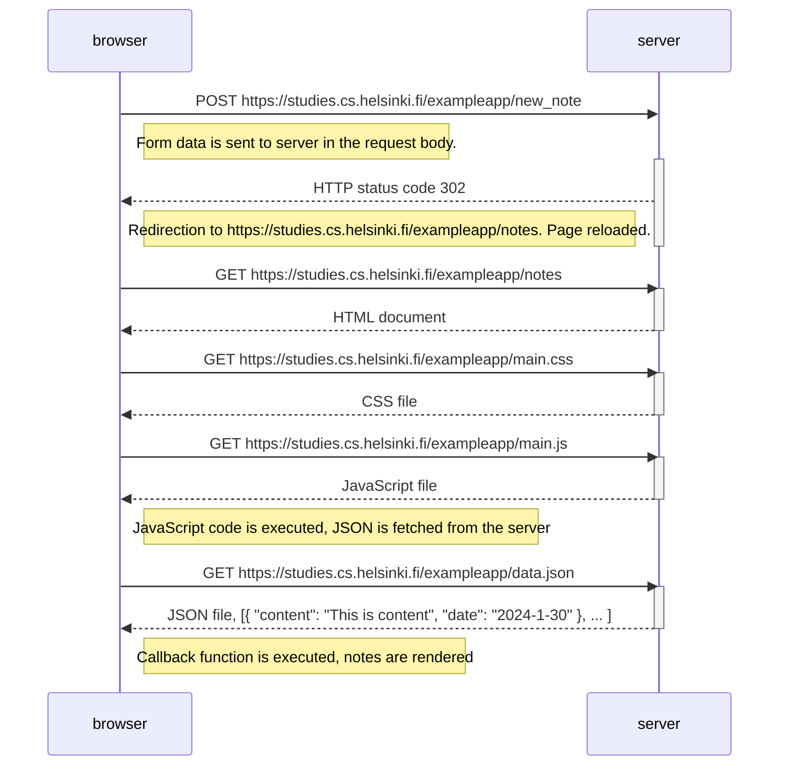

```mermaid
sequenceDiagram
participant browser
participant server

browser->>server: POST https://studies.cs.helsinki.fi/exampleapp/new_note
Note right of browser: Form data is sent to server in the request body.
activate server
server-->>browser: HTTP status code 302
Note left of server: Redirection to https://studies.cs.helsinki.fi/exampleapp/notes. Page reloaded.
deactivate server


browser->>server: GET https://studies.cs.helsinki.fi/exampleapp/notes
activate server
server-->>browser: HTML document
deactivate server

browser->>server: GET https://studies.cs.helsinki.fi/exampleapp/main.css
activate server
server-->>browser: CSS file
deactivate server

browser->>server: GET https://studies.cs.helsinki.fi/exampleapp/main.js
activate server
server-->>browser: JavaScript file
deactivate server

Note right of browser: JavaScript code is executed, JSON is fetched from the server

browser->>server: GET https://studies.cs.helsinki.fi/exampleapp/data.json
activate server
server-->>browser: JSON file, [{ "content": "This is content", "date": "2024-1-30" }, ... ]
deactivate server

Note right of browser: Callback function is executed, notes are rendered
```
