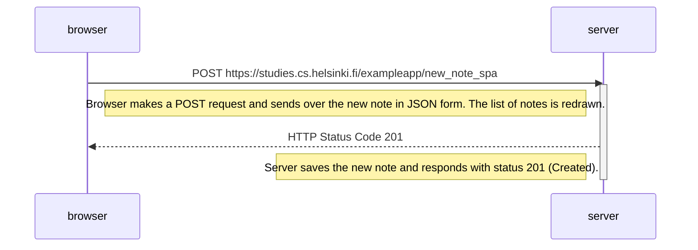

```mermaid
sequenceDiagram
participant browser
participant server

browser->>server: POST https://studies.cs.helsinki.fi/exampleapp/new_note_spa
activate server
Note right of browser: Browser makes a POST request and sends over the new note in JSON form. The list of notes is redrawn.
server-->>browser: HTTP Status Code 201
Note left of server: Server saves the new note and responds with status 201 (Created).
deactivate server
```